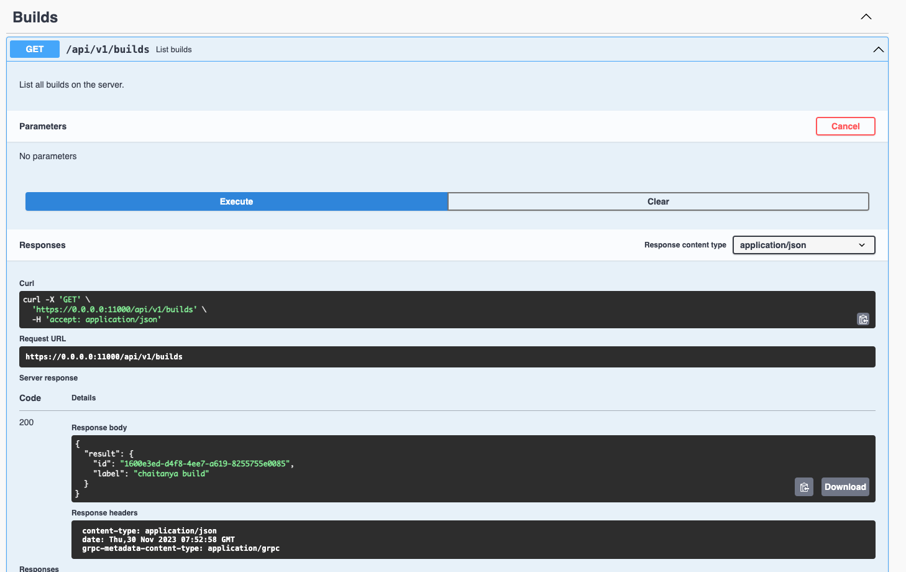

# golang-grpc-http

All the boilerplate you need to get started with writing grpc-gateway powered
REST services in Go.

## Requirements

Go 1.21.4+

## Running

Running `main.go` starts a web server on https://0.0.0.0:11000/. You can configure
the port used with the `$PORT` environment variable, and to serve on HTTP set
`$SERVE_HTTP=true`.

```
$ go run main.go
```

Post endpoint

Here is how you can test adding a new record by calling rest endpoint


Get endpoint

Here is how you can fetch list of records by calling rest endpoint



An OpenAPI UI is served on https://0.0.0.0:11000/.

Due to some certificate issue not able to run the grpc calls, but i belive it should work.

## Reference
- [Boiler plate git repo](https://github.com/johanbrandhorst/grpc-gateway-boilerplate)
- [Youtube video](https://www.youtube.com/watch?v=AaqZvsrULi4)

